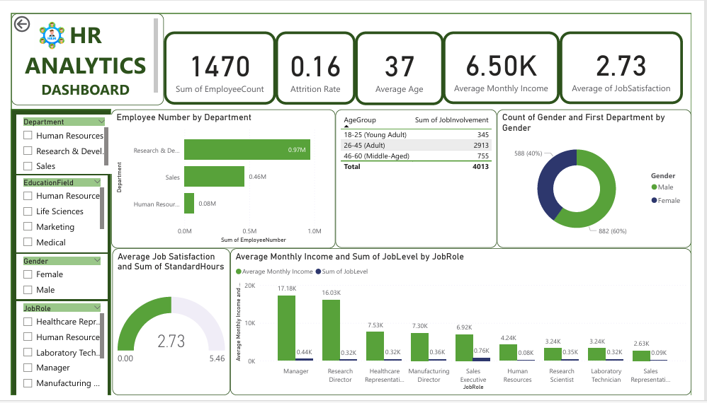
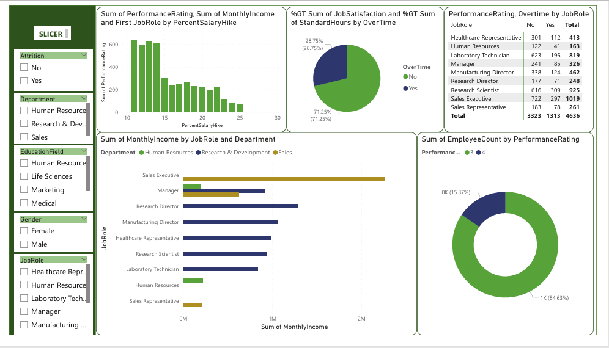
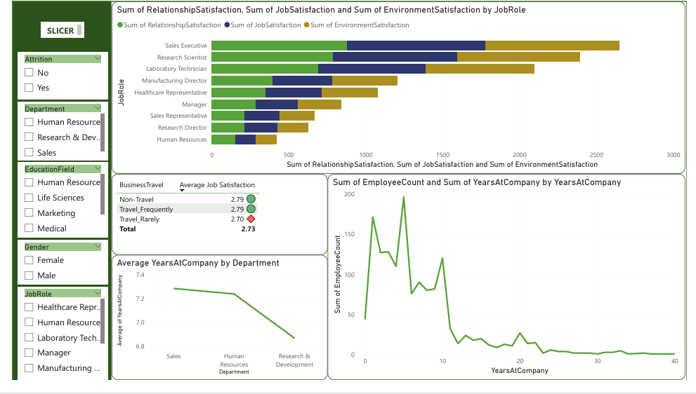
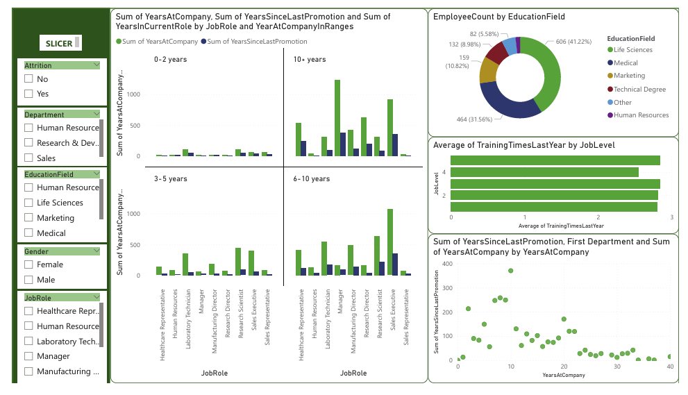

# 📊 HR Analytics Dashboard

> A multi-page Power BI dashboard delivering deep workforce insights across attrition, performance, compensation, satisfaction, and employee tenure.

---

## 📌 Project Overview

This HR Analytics Dashboard was built in Power BI to help HR teams and business leaders make informed, data-driven decisions about their workforce. Using a dataset of **1,470 employees**, the dashboard surfaces key patterns across departments, job roles, education fields, and demographic segments — enabling leadership to act on attrition risks, compensation gaps, and employee satisfaction trends.

---

## 🖼️ Dashboard Preview

### Page 1 — Workforce Overview


### Page 2 — Performance & Compensation


### Page 3 — Satisfaction & Retention


### Page 4 — Tenure & Development


---

## 🔍 Key Metrics Tracked

| Metric | Value |
|---|---|
| Total Employees | 1,470 |
| Attrition Rate | 16% |
| Average Age | 37 years |
| Average Monthly Income | $6,500 |
| Average Job Satisfaction | 2.73 / 5 |

---

## 📋 Dashboard Pages & Insights

### Page 1 — Workforce Overview
- **Employee count by department**: Research & Development leads with 0.97M in employee count sum, followed by Sales (0.46M) and Human Resources (0.08M)
- **Age group distribution**: The adult group (26–45) dominates job involvement with 2,913, compared to 755 middle-aged and 345 young adults
- **Gender split**: 60% Female, 40% Male across the organisation
- **Job satisfaction gauge**: Average satisfaction score sits at 2.73 out of 5.46, signalling room for improvement
- **Income vs. Job Level by role**: Managers and Research Directors command the highest average monthly incomes at $17.18K and $16.03K respectively

### Page 2 — Performance & Compensation
- **Salary hike vs. performance**: Performance ratings cluster between the 10–25% salary hike range, with diminishing returns beyond 20%
- **Overtime impact**: 71.25% of employees do not work overtime; however, overtime workers show a notably different satisfaction and job involvement profile
- **Income by role and department**: Sales Executives earn the highest monthly income across all three departments, followed by Managers and Research Directors
- **Performance rating by overtime**: Sales Executives (1,019 total) and Research Scientists (925 total) are the largest role groups; overtime is most prevalent among Sales Executives (297) and Research Scientists (309)
- **Performance distribution**: 84.63% of employees are rated at performance level 4, with only 15.37% at level 3

### Page 3 — Satisfaction & Retention
- **Satisfaction by job role**: Sales Executives and Research Scientists report the highest combined relationship, job, and environment satisfaction scores
- **Business travel vs. satisfaction**: Non-Travel and Travel_Frequently employees share an average satisfaction of 2.79, while Travel_Rarely employees score slightly lower at 2.70
- **Tenure distribution**: Employee headcount peaks at around the 1–5 years mark, then sharply declines — indicating a potential retention challenge at the mid-career stage
- **Average tenure by department**: Sales averages the highest years at company (~7.3), followed by Human Resources (~7.1) and Research & Development (~6.9)

### Page 4 — Tenure & Development
- **Tenure cohort analysis**: Employees in the 10+ year cohort show the highest cumulative years at company and years since last promotion, suggesting potential promotion bottlenecks for long-tenured staff
- **Education field breakdown**: Life Sciences accounts for the largest share of employees (41.22%), followed by Medical (31.56%) and Marketing (10.82%)
- **Training frequency by job level**: Higher job levels (4–5) receive more training sessions per year on average than entry-level roles
- **Promotion vs. tenure scatter**: A wide spread in years since last promotion for employees at the 10–20 year tenure mark points to stagnation risk

---

## 🛠️ Tools & Technologies

| Tool | Purpose |
|---|---|
| **Power BI Desktop** | Dashboard design and publishing |
| **Power Query** | Data cleaning and transformation |
| **DAX** | Custom measures, KPIs, and calculated columns |
| **Excel / CSV** | Source data format |

---

## 💡 Key Findings & Recommendations

1. **Attrition risk is highest among mid-career employees (5–10 years tenure)** — targeted retention programmes, career path clarity, and compensation reviews at this stage could reduce churn.

2. **Job satisfaction averaging 2.73/5 is a red flag** — particularly for Sales Representatives and Research Directors, who show lower combined satisfaction scores. Exit interview data and pulse surveys are recommended.

3. **Promotion gaps for long-tenured employees** — employees with 10+ years and high years since last promotion are flight risks. A structured promotion review cadence could address this.

4. **Overtime is concentrated in specific roles** — Sales Executives and Research Scientists carry a disproportionate overtime burden. Workload redistribution or headcount additions in these areas could improve both wellbeing and retention.

5. **Life Sciences dominates the talent pool** — hiring and upskilling strategies should account for this concentration to maintain departmental balance.

---

## 📁 Project Structure

```
hr-analytics-dashboard/
│
├── README.md
├── data/
│   ├── raw/
│   │   └── hr_data.csv              # Original dataset
│   └── cleaned/
│       └── hr_data_cleaned.csv      # Cleaned and transformed data
│
├── dashboard/
│   └── hr_analytics.pbix            # Power BI dashboard file
│
├── images/
│   ├── dashboard_overview.png
│   ├── performance_compensation.png
│   ├── satisfaction_retention.png
│   └── tenure_development.png
│
└── docs/
    └── insights_summary.pdf         # Written summary of findings
```

---

## 🚀 How to Use

1. Clone or download this repository
2. Open `dashboard/hr_analytics.pbix` in **Power BI Desktop**
3. If prompted, update the data source path to point to `data/cleaned/hr_data_cleaned.csv`
4. Use the slicers on the left panel to filter by **Attrition**, **Department**, **Education Field**, **Gender**, and **Job Role**
5. Navigate between the four dashboard pages using the page tabs at the bottom

---

## 👤 Author

**Mayowa Phillip** — Data Analyst

- 📧 mayowaphillip@yahoo.com
- 💼 [LinkedIn](https://linkedin.com/in/mayowaphillipelnuk)
- 🐙 [GitHub](https://github.com/mayowaphillip)

---

*Built with Power BI | DAX | Power Query*
